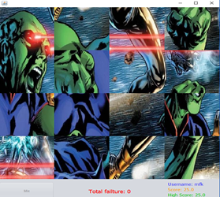

# Puzzle Game

## Description
It is a software in which an image given by the user is divided into 16 equal parts and then all parts of this image are mixed and the user is expected to complete the picture again. In this software, the scores are made as a result of the matches made by the user, and after the software is terminated, this score is written in a file and the data is read in this file in the next runs.

## Dependency

This program uses Netbeans IDE's GUI libraries.

## Usage

Clone and run with Netbeans IDE. Just that simple :)

## Contributing
Pull requests are welcome. For major changes, please open an issue first to discuss what you would like to change.

Please make sure to update tests as appropriate.

## Authors
:bust_in_silhouette: Mehmet Fırat KÖMÜRCÜ

:bust_in_silhouette: Ali Recep KARACA

## Project Status

This is our school project.